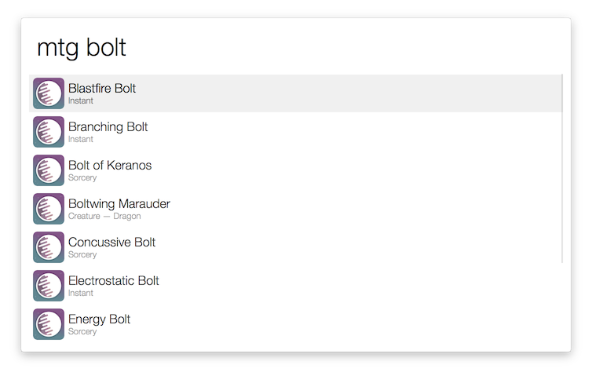
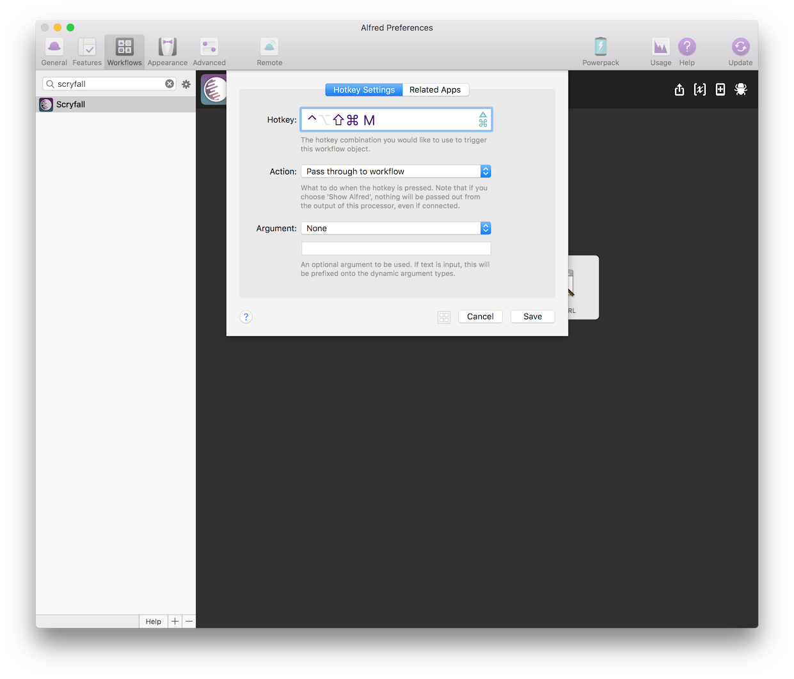
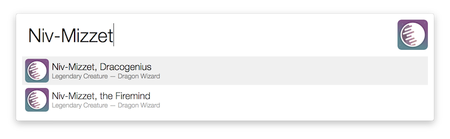

# scion

An Alfred worklow to quickly search for Magic cards on [Scryfall](https://www.scryfall.com).

## Features

After installing the workflow, type `mtg ` (with the space), followed by your search:

Optionally, go to the Alfred preferences and add a hotkey:

When invoked, the hotkey will then let you skip the prefix and start searching immediately:

